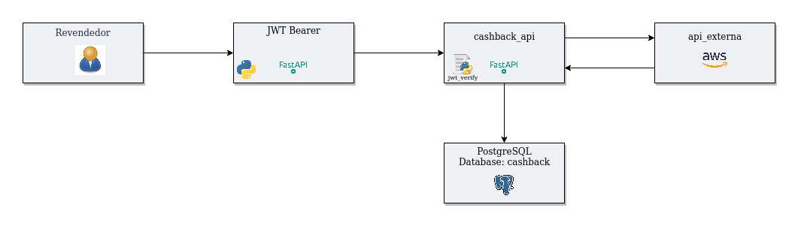
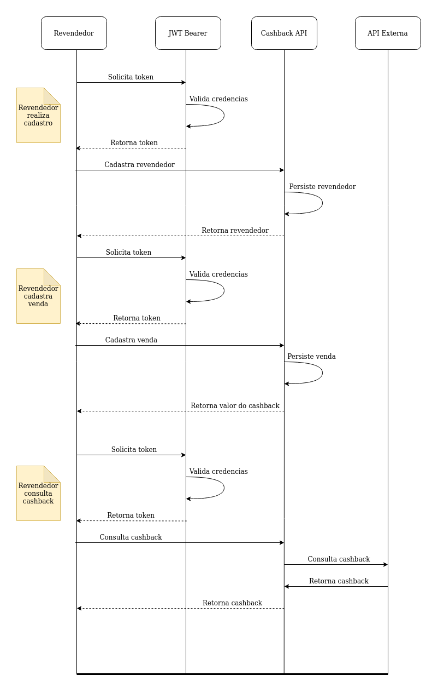
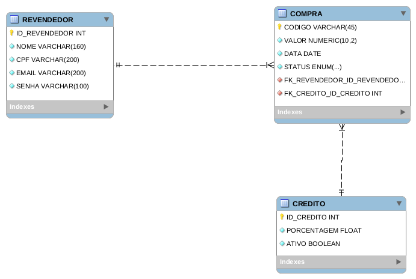
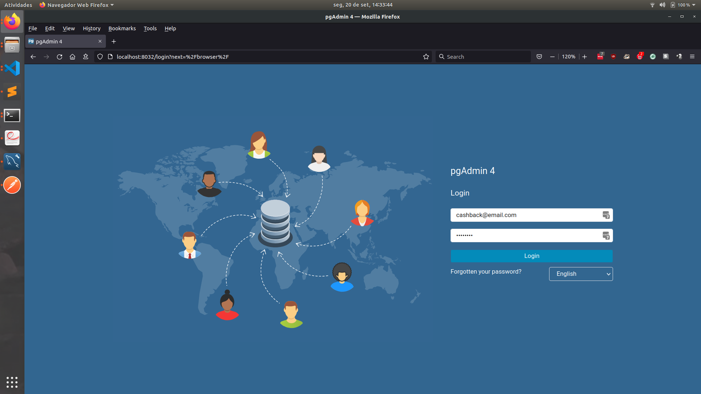
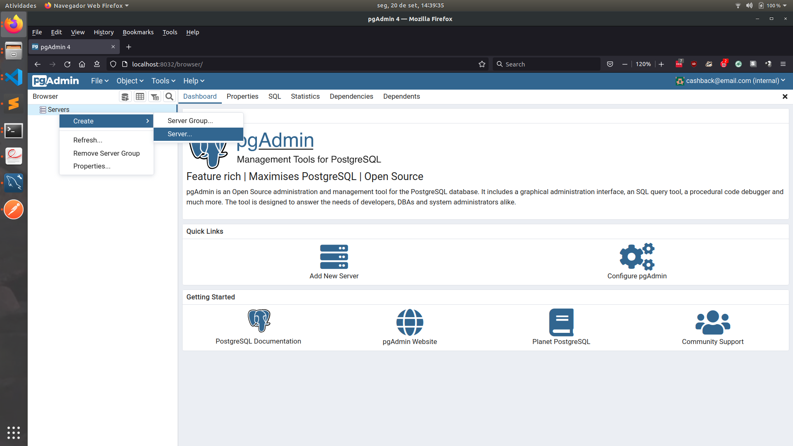
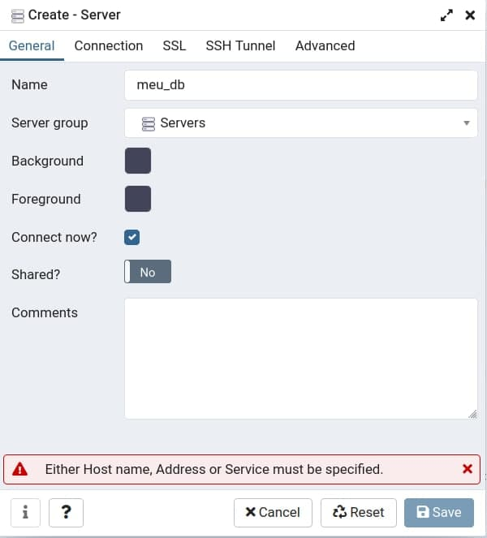
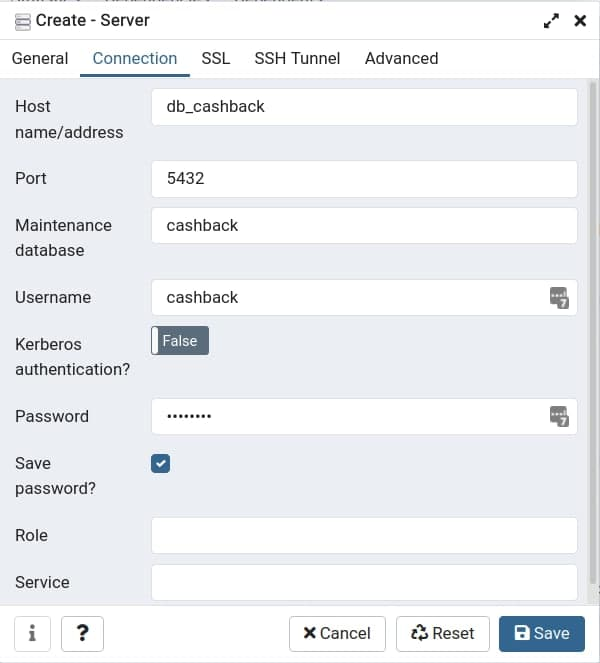
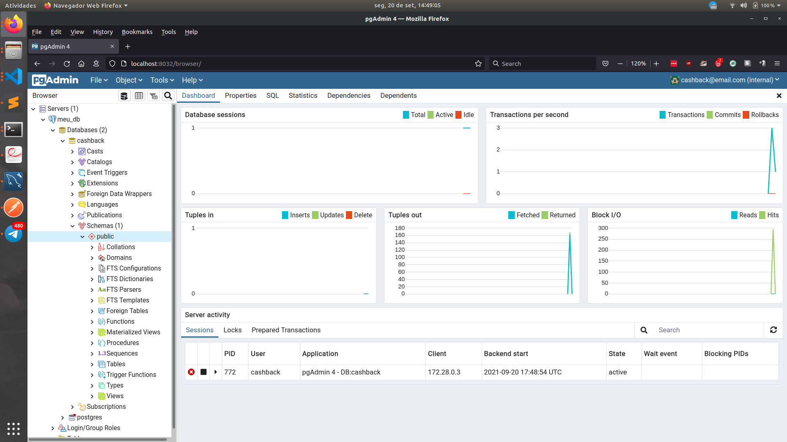
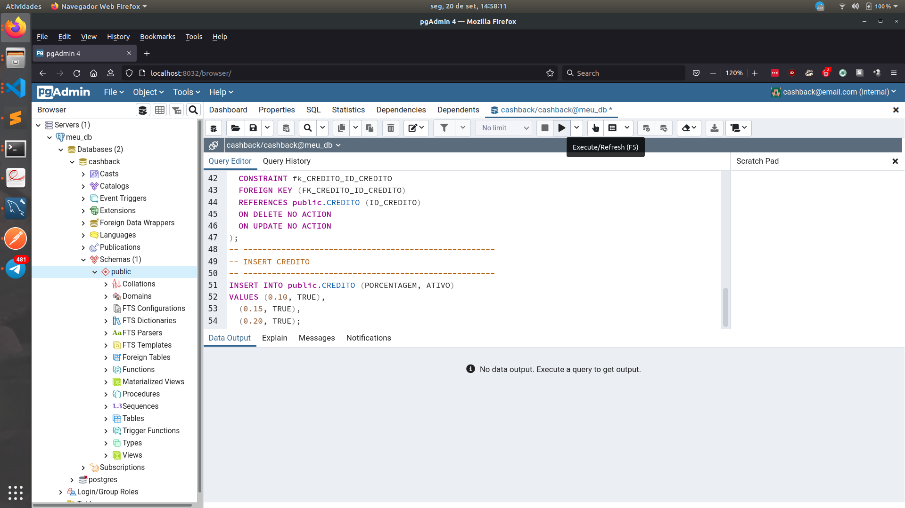

# desafio-tecnico-grupoboticario
Cashback é um sistema para seus revendedores(as) cadastrarem suas compras e acompanhar o retorno de cashback de cada um.

Cashback quer dizer “dinheiro de volta”, e funciona de forma simples: o revendedor faz uma compra e seu benefício vem com a devolução de parte do dinheiro gasto no mês seguinte.

O projeto não segue a risca os conceitos de `Clean Architecture`, no entanto, tenta ao máxima seguir a sua filosofia, uma vez que possuí de forma desacoplada seus módulos, classes e métodos.

Na pasta [arquitetura](arquitetura) podem ser encontradas a modelagem do banco de dados e a arquitetura do sistema como um todo. Serve também como uma visão geral do sistema e como foi estruturado.

## Arquitetura

Os conceitos de `Clean Architecture` e de `Arquitetura de Microsserviços` não foram seguidos a risca, mas sim, adapatados a proposta do desafio técnico. Uma camada de `ORM`, a exemplo do [SQLAlchemy](https://www.sqlalchemy.org/) poderia ter sido utilizada antes do banco de dados desacoplando ainda mais o sistema e isolando as regras de negócio. Na arquitetura proposta do banco de dados, um novo banco poderia facilmente ser trocado, por exemplo, ao contrário de um PostgreSQL poderia ter sido utilizado um MongoDB e o que restaria a ser feito neste caso é reescrever alguns métodos da classe [Database](cashback_api/database/__init__.py).

Uma visão mais geral da arquitetura pode ser encontrada na imagem abaixo:



Já uma visão mais detalhada de cada passo executado dentro da aplicação pode ser encontrada no arquivo abaixo:



A modelagem do banco de dados pode ser encontrada a seguir:



Tomou-se a iniciativa de versionar o banco de dados, afim de manter um histórico do banco de dados e também de se discutir melhorias e erros que foram encontrados ao longo da solução do desafio técnico.

## Documentação

Todo o código foi documentado utilizando [Sphinx](https://www.sphinx-doc.org/en/master/), é possível acessar a documentação técnica do projeto acessando os endpoints abaixo:

[Cashback-APi](http://localhost:7000/v1/docs)

## Pré-requisitos

Clone este repositório

```bash
git clone https://github.com/kevinsantana/desafio-tecnico-grupoboticario.git
```

Para executar o projeto é preciso que [docker](https://docs.docker.com/) e o [docker-compose](https://docs.docker.com/compose/) estejam devidamente configurados, e que uma variável de ambiente `JWT_SECRET` seja gerada e exportada no terminal que vai executar a aplicação.
Essa variável será usada para codificar e decodificar _tokens_ `JWT` uma maneira segura de gerar está variável é da seguinte maneira:

```python
import os
import binascii

binascii.hexlify(os.urandom(24)).decode("utf-8")
```

## Execução

Com o `docker`, `docker-compose` e a variável de ambiente `JWT_SECRET` exportada no seu terminal, basta executar:

```bash
make run
```

Com a aplicação em execução, é necessário executar o _script_ de criação do banco de dados. Para isto, execute os passos a seguin:

1. Acesse o endereço [pgAdmin](http://localhost:8032/) com as credenciais `cashback@email.com` e `cashback`



2. Clique em `Servers` depois em `Create` depois em `Server`



3. Na janela `Create - Server` na aba `General` dê um nome para o banco de dados



4. Na aba `Connection`, preencha com as informações abaixo


| Campo       | Valor     | 
| :------------- | :----------: |
|  Hostname/address | db_cashback  |
| Port   | 5432 |
| Maintenence database   | Put Pipes In |
| Username   | cashback |
| Password   | cashback |



5. Com a conexão criada clique em `Servers` depois na conexão nomeada no passo anterior, clique em `Databases` depois em `cashback` e por último em `Schemas` com o botão direito clique em `Query Tool`



6. Copie o conteúdo do arquivo [create.sql](cashback_api/scripts/create.sql) cole na nova aba aberta a direita `Query Tool` e clique em `Execute/Refresh (F5)`



## Testes

Após executar a aplicação e o script do banco de dados, com os _containers_ em execução, execute o seguinte comando:

```bash
docker container exec -it cashback_api pytest -v
```

## Autenticação

A aplicação utiliza autenticação `JWT` para consumir os endpoints protegidos é necessário um `Access Token` gerado no endpoint [login](http://localhost:7000/v1/login). Caso utilize o `Swagger` da aplicação clique em [Swagger](http://localhost:7000/v1/swagger) para acessar a raíz do `Swagger` e em `Authorize` insira o token de autenticação. O token tem 30min de duração.


### Autoformatter

O projeto conta com o [Black](https://github.com/psf/black) que é um `autoformatter`, formatando o código caso exista algum trecho de código que não siga a PEP8. Para executá-lo basta rodar o seguinte comando no terminal:

```bash
make black
```

## Deploy

Com a aplicação _dockerizada_ e testada, é possível efetuar o _deploy_ em um orquestrador de _containers_ a exemplo do [Kubernetes](https://kubernetes.io/pt/), ou mesmo, com o orquestrador nativo do Docker [Swarm](https://docs.docker.com/engine/swarm/).

## Construído Com

* [psycopg2](https://www.psycopg.org/)
* [black](https://github.com/psf/black)
* [loguru](https://github.com/Delgan/loguru)
* [pydantic](https://pydantic-docs.helpmanual.io)
* [fastapi](https://fastapi.tiangolo.com)
* [uvicorn](https://www.uvicorn.org)
* [gunicorn](https://gunicorn.org)
* [requests](https://requests.readthedocs.io/en/master/)
* [sphinx](https://www.sphinx-doc.org/en/master/)

## Versionamento

O versionamento segue o padrão do [Versionamento Semântico](http://semver.org/).

## License

Todos os direitos são reservados ao autor Kevin de Santana Araujo.

## Outras informações

* Caso tenha alguma dúvida em relação ao projeto, ou queira contribuir com sugestões ou críticas, abra uma [issue]() ou procure o desenvolvedor através do email kevin_santana.araujo@hotmail.com
